# Topology Change Detector

An SDN project using Mininet and the POX OpenFlow controller to detect topology changes dynamically, update a topology map, display/log switch and link events, and install explicit OpenFlow forwarding rules.

## Demonstration & Screenshots

### 1. Controller Start Logs
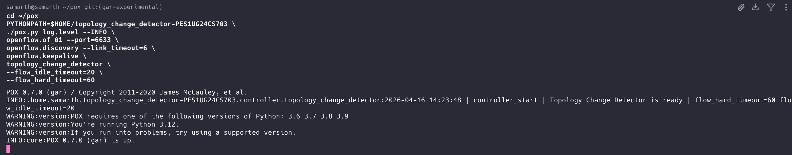

### 2. Pingall Command
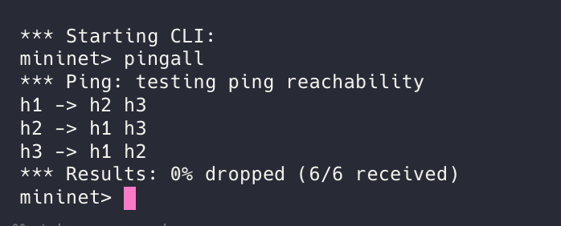

### 3. Packet Transmission & Controller Verification
**3A. Iperf Output** (Verifying actual packets are correctly sent)  
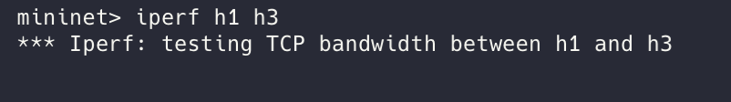

**3B. Controller Logs** (Showcasing packets are getting sent)  
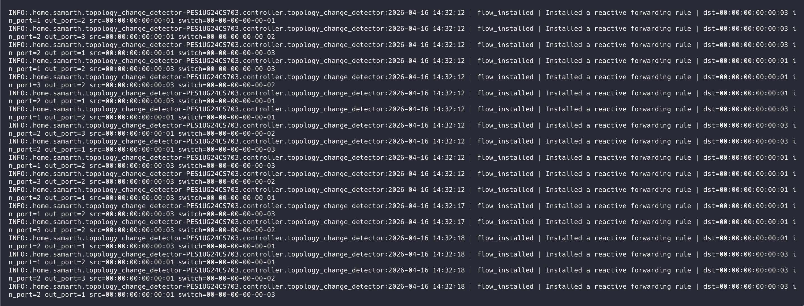

### 4. Link Down Scenario
**4A. Triggering Link Down**  
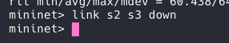

**4B. Controller Logs** (Correctly showing a topology change)  
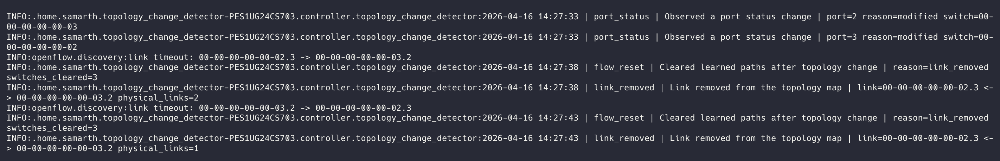

**4C. h3 Ping** (Fails because the link is down)  
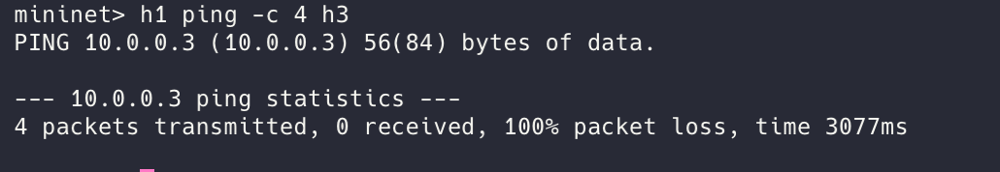

**4D. h2 Ping** (Succeeds because the link is still intact)  
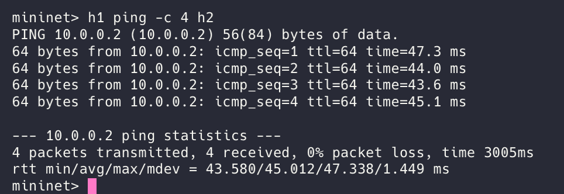

### 5. Link Up Scenario
**5A. Triggering Link Up**  
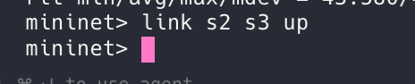

**5B. Controller Logs** (Topology change detected)  
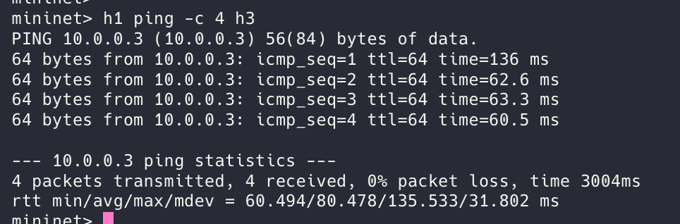

### 6. Topology Visualisation
**Visualisation of the topology from the created JSON map**  
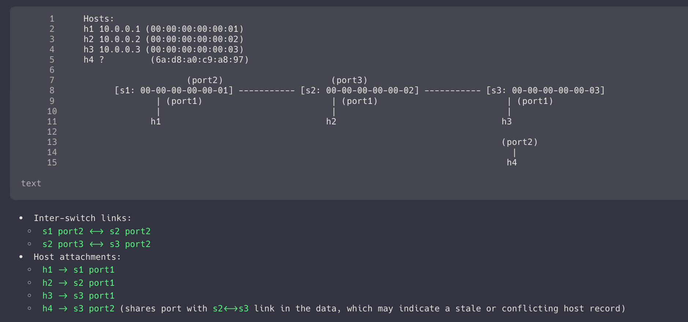

## Problem Statement

This project implements a **Topology Change Detector** for a software-defined network. The controller monitors:

- Switch connect/disconnect events
- Port status changes
- Link up/down events discovered through LLDP
- Host attachment points learned from `packet_in` events

The controller also installs **reactive OpenFlow 1.0 flow rules** so the project satisfies both topology-monitoring and match-action rule requirements from the assignment.

## Objective

The project demonstrates:

- Controller-switch interaction using POX and OpenFlow
- Explicit match-action flow installation on `packet_in`
- Dynamic topology discovery and topology-change detection
- Network behavior observation using `ping`, `iperf`, flow-table dumps, and controller logs

## Why POX

This project uses **POX** instead of Ryu because current POX `gar` officially runs on **Python 3**, which makes it a better fit for modern Ubuntu environments such as Ubuntu 24.04.

## Topology Design

The demo uses a simple 3-switch line topology:

`h1 -- s1 -- s2 -- s3 -- h3`

with `h2` attached to `s2`.

Reason for this choice:

- It is easy to explain in a viva
- Link failure and recovery are easy to trigger live
- The controller can clearly show topology updates
- The behavior before failure, during failure, and after recovery is easy to validate

## Project Structure

```text
.
├── controller/
│   └── topology_change_detector.py
├── topology_change_detector.py
├── topologies/
│   └── topology_change_demo.py
├── artifacts/
│   └── .gitkeep
└── docs/
    └── screenshots/
```

## SDN Logic

### 1. Topology Monitoring

The POX controller listens for:

- `ConnectionUp` and `ConnectionDown` for switch events
- `PortStatus` for port changes
- `LinkEvent` from `openflow.discovery` for LLDP-based link discovery/removal

Whenever a topology change happens, the controller:

- Updates the in-memory topology map
- Writes the current topology to `artifacts/topology_state.json`
- Appends a readable event log to `artifacts/topology_events.log`
- Clears previously learned forwarding state and deletes installed flows so the topology can be relearned safely

### 2. Flow Rule Design

The controller handles `packet_in` events and uses the following logic:

1. Ignore LLDP/control traffic
2. Learn source MAC to ingress port mapping
3. Record hosts seen on edge ports
4. Flood unknown destinations
5. Install an OpenFlow rule for known destinations

Flow rule details:

- Match: `ofp_match.from_packet(packet, in_port)`
- Action: `output:<learned_port>`
- Idle timeout: `20` seconds
- Hard timeout: `60` seconds

This is explicit OpenFlow match-action logic and satisfies the controller-logic requirement in the assignment.

## Environment

Target runtime used for this project:

- Ubuntu 24.04.4 LTS
- ARM64
- Mininet + Open vSwitch
- POX controller
- OpenFlow 1.0

## Setup

Run these commands on your Ubuntu VM.

### 1. Install required packages

```bash
sudo apt update
sudo apt install -y git python3 mininet openvswitch-switch iperf iperf3 tcpdump
```

`Wireshark` GUI is optional. Over SSH, `tcpdump` is usually the easiest capture tool and is fully acceptable as proof of execution.

### 2. Clone POX and this repository

```bash
cd ~
git clone https://github.com/noxrepo/pox.git
git clone https://github.com/8figalltimepro/topology_change_detector_PES1UG24CS703.git
```

## Execution

Open terminal 1 and start POX:

```bash
cd ~/pox
PYTHONPATH=$HOME/topology_change_detector-PES1UG24CS703 \
./pox.py log.level --INFO \
openflow.of_01 --port=6633 \
openflow.discovery --link_timeout=6 \
openflow.keepalive \
topology_change_detector \
--flow_idle_timeout=20 \
--flow_hard_timeout=60
```

Open terminal 2 and start Mininet:

```bash
cd ~/topology_change_detector-PES1UG24CS703
sudo python3 topologies/topology_change_demo.py --controller-ip 127.0.0.1 --controller-port 6633
```

## Validation Scenarios

You need at least two scenarios for the demo. Use these.

### Scenario 1: Normal Topology / Normal Forwarding

Inside the Mininet CLI:

```bash
pingall
h1 ping -c 4 h3
iperf h1 h3
sh ovs-ofctl -O OpenFlow10 dump-flows s1
sh ovs-ofctl -O OpenFlow10 dump-flows s2
sh ovs-ofctl -O OpenFlow10 dump-flows s3
```

Expected observations:

- All hosts are reachable in `pingall`
- `h1` to `h3` ping succeeds
- `iperf` shows non-zero throughput
- Flow tables contain controller-installed forwarding entries
- `artifacts/topology_state.json` shows 3 switches and 2 switch-to-switch links

### Scenario 2: Link Failure and Recovery

Inside the Mininet CLI:

```bash
link s2 s3 down
h1 ping -c 4 h3
h1 ping -c 4 h2
sh ovs-ofctl -O OpenFlow10 dump-flows s2
link s2 s3 up
h1 ping -c 4 h3
iperf h1 h3
```

After each `link ... down` or `link ... up`, wait about `6-8` seconds so LLDP discovery has time to detect the topology change and update the controller state.

Expected observations:

- Controller log records `link_removed`
- Topology state updates to reflect the missing link
- `h1` to `h3` traffic fails while `s2-s3` is down
- `h1` to `h2` still works because that path remains connected
- After `link s2 s3 up`, the controller logs `link_added`
- Connectivity between `h1` and `h3` is restored
- New flow entries appear after traffic is relearned

## Useful Proof Commands

### 1. Controller log

```bash
tail -f ~/topology_change_detector-PES1UG24CS703/artifacts/topology_events.log
```

### 2. Current topology map

```bash
cat ~/topology_change_detector-PES1UG24CS703/artifacts/topology_state.json
```

### 3. Packet capture

Run this in another terminal while you generate traffic:

```bash
sudo tcpdump -i any -nn "icmp or arp or tcp port 5001"
```

If you already have `tshark` installed, this also works:

```bash
sudo tshark -i any -f "icmp or arp or tcp port 5001"
```

## Expected Output Summary

During startup:

- Switches connect to the controller
- LLDP discovery detects links
- The topology JSON file is created

During forwarding:

- `packet_in` events cause learning
- OpenFlow flow rules are installed for known destinations

During failure:

- Link removal is logged
- Flows are cleared
- The topology map is updated
- End-to-end connectivity changes exactly as expected
